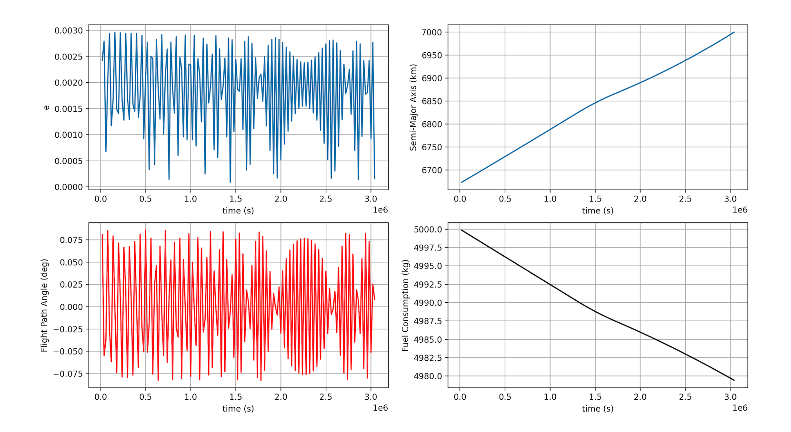

# Spaceplane-Project

# Introduction

This Project seeks to optimize fuel requirements in the upper stages of trans atmospheric ascent in a spaceplane launch system. In Order to do this 4 main functions were built in 'main.py'. These were the TwoBody,solver, dv, constraint. To facilitate the creation of graphs for the six orbital elements and to streamline the organisation of the code a seperate module 'toolbox.py' was made to hold additional functions to be called by the 'main.py'. In order to simplify this project the initial orbital parameter are kept at inclination=0 and the assumption that the initial and final orbit align on the same plane.

libraries used: Numpy

# TwoBody

This function was built using the Cowells method of account for perturbative forces where the addition of accelerations for thrusts, J2, Atmospheric drag are all accounted for to be later called by the function 'solver'.

# dv

This is the function that calculates the delta-v required for any transfer and is the minimization function that we are trying to achieve.

# Constraint

This function has the inputs of both initial and final positions and when calling the solver weights the solvers final position (in orbital elements) with the target positions and optimizer tries to optimize this value by altering the control node 'u'. When the constraint function returns an approxiamation closest to zero for all 3 weighted orbital elements it has found the optimal control and it reassigns it the control node 'u'.

# Results

## High Thrust

This simulation shows the model finding the optimal trajactory for a high thrust orbital transfer to from a height of 6800km from the Earth Centre to 10000km.

## Low Thrust

Low Thrust showed similar behaviour to the High thrust image except with manay more revolutions which is to be expected as the thrust only allows for substantial increase of acceleration over a given amount of time. What is more interesting is observing the fuel consumption along with the behaviour of the flight eccentricity and flight path angle. the former remaining very circular for the entire transfer as well as the flight path angle.

# Orbit Decay

When accounting for Perturbations for J2, atmospheric pressure and thrust, the amount of initial thrust the spaceplane has is critical for it to remain in orbit. Below can be seen if insufficient thrust is applied to the craft.

with cach revolution of the orbit of the craft is slowly decaying and will eventually crash.
